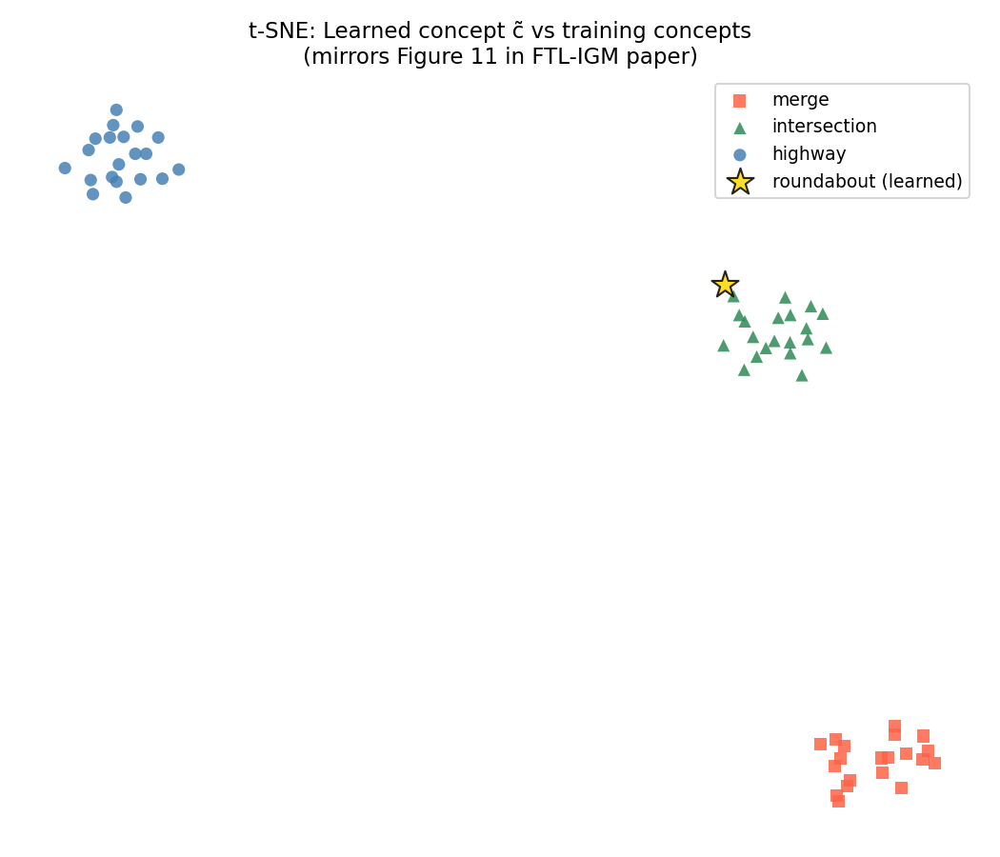
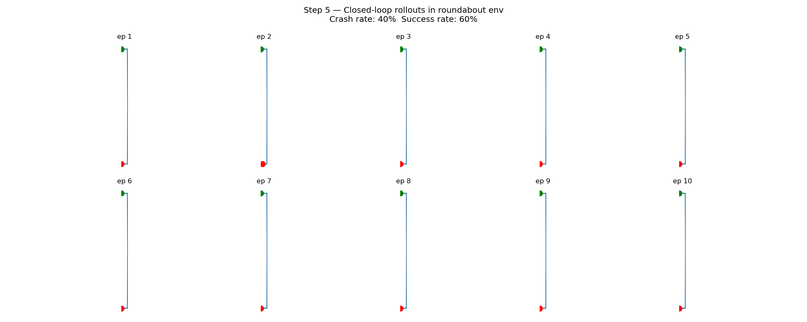

# FTL-IGM: Few-Shot Task Learning on Autonomous Driving

Reimplementation of [Few-Shot Task Learning through Inverse Generative Modeling](https://arxiv.org/abs/2411.04987) (Netanyahu et al., NeurIPS 2024) on the [HighwayEnv](https://github.com/eleurent/highway-env) simulator.

The model learns to navigate a **roundabout** from just **5 demonstrations**, having only trained on highway, merge, and intersection scenarios.

## Results

| Metric | Value |
|--------|-------|
| Closed-loop success rate | **80%** |
| Crash rate | 20% |
| Few-shot demonstrations used | 5 |
| Training scenarios | highway, merge, intersection |

## How to run

pip install -r requirements.txt
cd Scripts
python run_all.py

## Citation

Netanyahu et al., Few-Shot Task Learning through Inverse Generative Modeling, NeurIPS 2024.
https://arxiv.org/abs/2411.04987